**Welcome to the Git Tutorial**

<p style="text-align: center;">
In this tutorial you will learn how to use basic git commands. If you're curious about the benefits of git, I recommend reading this <a href="https://medium.com/swlh/git-as-the-newbies-learning-steroid-963a2146220b">article</a>. Our project will be a basic quiz game to implement our git commands on
</p>
<br>

1. **Opening git bash**
The git command line can be accessed from opening the git bash program. Uponing opening git bash, you should be greeted with a screen like this: <br>
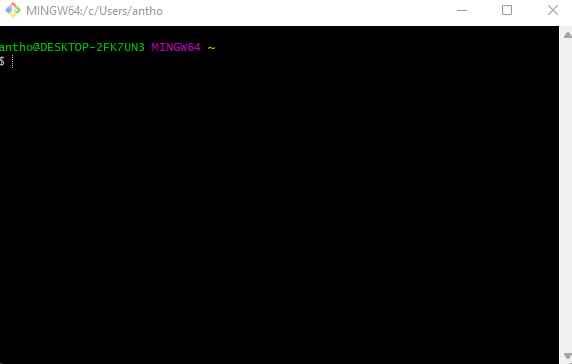
<br>
**This is where all git commands will be typed.**
<br>

2. **git clone**
Go to the Github repo and copy the link shown under -*HTTPS*-:
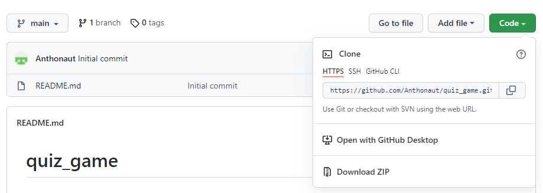
<br>

Type in the command line `git clone paste_repo_link_here`. The `git clone` command will pull the repo and all files associated with it as a *directory* on your local machine. This directory will have the same name as the repository name. Next, use the `cd` command to traverse into the directory. Your command line should now look like this:<br>
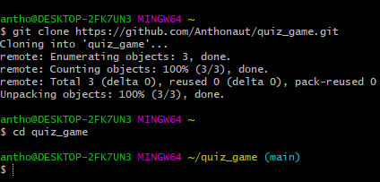
<br>

3. **Make the quiz game file**
We will now start with making the file for our quiz game. Type in the command line `touch quiz_game.py`. The `touch` command is an UNIX command on the terminal that creates files. To check we've created our quiz game file, we type `ls` (another UNIX command) on the command line. You should then see the python file we created for our quiz game:
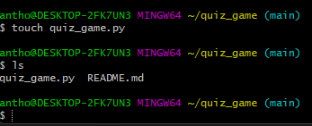
<br>

Open the **quiz_game.py** file on your local machine and add the following code:<br>
```python
# --------------------
def new_game():  # Creates a new quiz game
    guesses = []
    correct_guesses = 0
    question_num = 1

    for key in questions:
        print("---------------------")
        print(key) # print out the question
        for i in options[question_num - 1]: # Access the question choices and print them for each question
            print(i)
        guess = input("Enter (A, B, C, or D): ") # Player types in a guess
        guess = guess.upper() # Still capitalize if the player puts the lowercase of the letters
        guesses.append(guess) # To hold our guesses for display at the end

        correct_guesses += check_answer(questions.get(key), guess) # Check guess with answer key, give 1 point if correct
        question_num += 1
# --------------------
def check_answer(answer, guess):
    if answer == guess:
        print("CORRECT!")
        return 1
    else:
        print("WRONG!")
        return 0
# --------------------

questions = { # A dictionary works to hold a question:answer pair (key:value)
    "Who created Python?": "A",
    "What year was Python created?": "B",
    "Python is attributed to which comedy group": "C",
    "Is the Earth round?": "A"
}

# A 2D list to hold the different answer choices for each question (e.g 1st list for question 1)
options = [["A. Guido van Rossum", "B. Elon Musk", "C. Bill Gates", "D. Mark Zuckerburg"],
          ["A. 1989", "B. 1991", "C. 2000", "D. 2016"],
          ["A. Lonely Island", "B. Smosh", "C. Monty Python", "D. SNL"],
          ["A. True","B. False", "C. sometimes", "D. What's Earth?"]]

new_game()

print("Bye!")
```
<br>

<Center>The next set of git commands we will use is standard for reflecting code changes on our local machine to the github repo</Center>

4. **git add**
The first step in updating our github repo is using the `git add` command. Type `git add quiz_game.py`: <br>
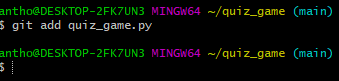
<br>

The `git add` command adds files to a *staging area*. This staging area can be thought of all the files we are looking to reflect our code changes with. In this case, we are looking to update our github repo with the inclusion of our `quiz_game.py` file with the starter code in it.
<br>

5. **git commit**
The next step is using the *git commit* command. Type `git commit -m "Added quiz_game.py"`:
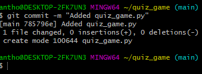
<br>

The `git commit` command can be thought of as the confirmation of files we've added/changed in the *staging area* to send to our github repo.

6. **git push**
Now we use the `git push` command. Type `git push origin main`: <br>
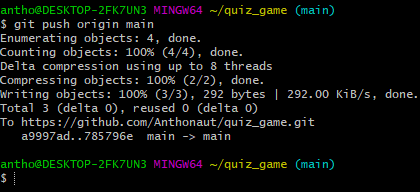
<br>

The `git push` command can be thought of as the official transmission of file additions and/or file changes to our github repo. You should now see **quiz_game.py** in your github repo:<br>
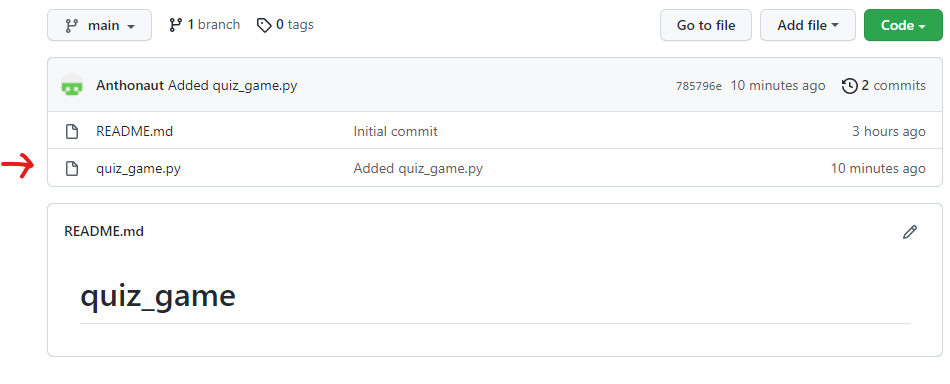
<br>

You can also see the code in the file when you click on it:
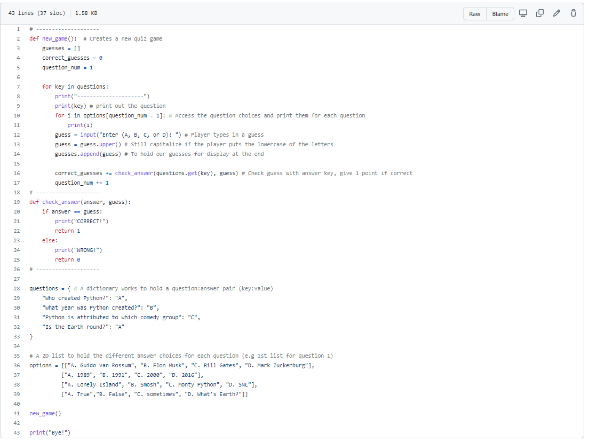
<br>

<Center>Congratulations! You've added your first file in real time to your github repo.</Center>
<br>
<Center>Now if we run our code we see that it doesn't display a score</Center>:<br>

<p align="center">
  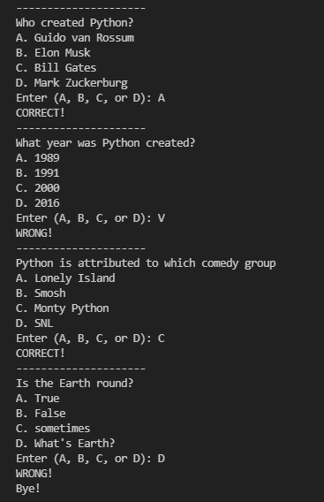
</p>
<br>

Lets spruce up our project a bit by adding a score feature. We can accomplish this using the `git branch` command and `git merge` command

**Branches**
You may have noticed the `(main)` in cyan after our directory path in the command terminal:<br>
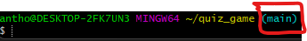
<br>
This is called our *main branch*. In fact, you've been working on the *main branch* so far of where our project code is. The convention in working with repositories is that they all have a *main branch* i.e the main code of a software/program. This *main branch* was formed from the *git clone* command.

A common practice in building a software/program is adding features to the main code. However, common practice in adding these features is to create a *branch*. A *branch* can be thought of as a copy of the main code, which we can add the code changes for a feature we want. This is beneficial because if adding our feature can create bugs or mess up our main code, then we can rest assure knowing these problems aren't happening on the real main code (i.e *main branch*).
A rule of thumb is: For every *feature* create a *branch*.
Now lets get to using the *git branch* to add the features we want.

7. **git branch**
We will start by making a branch for our score feature. Type `git branch score-feature`: <br>
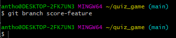

Even though we are still in the *main branch* as indicated by `(main)`, we can check actually check we made the branch by typing `git branch --list`:<br>
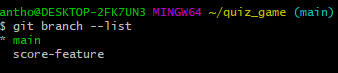

The `git branch --list` command lists out all branches, including *main*, that we have. The current branch we are in is also indicated by an asteriks `*` next to the branch name listed.

8. **git checkout**
Now that we've made our *score-feature branch*, we can move from the *main branch* to the *score-feature branch* by typing`git checkout score-feature`:<br>
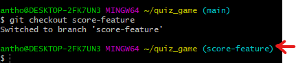
<br>

You will know you have switched branches if you now see `(score-feature)` in cyan next to your directory path, as well as a message saying *"Switched to branch score-feature"*.
The `git checkout` command is used to switch between branches using branch names.

9. **Add score-feature code**
Now that we are in the *score-feature branch*, we can now edit our file **quiz_game.py** by adding the code below with our score feature:
```python
# --------------------
def new_game():  # Creates a new quiz game
    guesses = []
    correct_guesses = 0
    question_num = 1

    for key in questions:
        print("---------------------")
        print(key) # print out the question
        for i in options[question_num - 1]: # Access the question choices and print them for each question
            print(i)
        guess = input("Enter (A, B, C, or D): ") # Player types in a guess
        guess = guess.upper() # Still capitalize if the player puts the lowercase of the letters
        guesses.append(guess) # To hold our guesses for display at the end

        correct_guesses += check_answer(questions.get(key), guess) # Check guess with answer key, give 1 point if correct
        question_num += 1
    display_score(correct_guesses, guess)
# --------------------
def check_answer(answer, guess):
    if answer == guess:
        print("CORRECT!")
        return 1
    else:
        print("WRONG!")
        return 0
# --------------------
def display_score(correct_guesses, guesses):
    print("---------------------")
    print("RESULTS")
    print("---------------------")

    print("Answers: ", end=" ") # Display all correct answers
    for i in questions:
        print(questions.get(i), end=" ")
    print()

    print("Guesses: ", end="") # Display guesses made by player
    for i in guesses:
        print(i, end=" ")
    print()

    score = (correct_guesses / len(questions)) * 100 # Score as a percentage
    print("Your score is: " + str(score) + "%")
# --------------------
questions = { # A dictionary works to hold a question:answer pair (key:value)
    "Who created Python?": "A",
    "What year was Python created?": "B",
    "Python is attributed to which comedy group": "C",
    "Is the Earth round?": "A"
}

# A 2D list to hold the different answer choices for each question (e.g 1st list for question 1)
options = [["A. Guido van Rossum", "B. Elon Musk", "C. Bill Gates", "D. Mark Zuckerburg"],
          ["A. 1989", "B. 1991", "C. 2000", "D. 2016"],
          ["A. Lonely Island", "B. Smosh", "C. Monty Python", "D. SNL"],
          ["A. True","B. False", "C. sometimes", "D. What's Earth?"]]

new_game()

print("Bye!")
```
<br> The only code additions we made are the `display_score()` function and calling it in the `new_game()` function

But wait a second, we have a little bug here in putting in our score feature:<br>
<p align="center">
  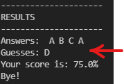
</p>
<br>

Instead of showing all our guesses, it has showed only the last guess from our `guess` variable in the `new_game()` function. Imagine if we were still on the *main branch* (i.e the main code) and we add our code for the score feature with this bug. Good thing on the *score-feature branch* we are working with a copy of the main code to test our feature on.

We can simply fix this by changing the input name from `guess` to `guesses` from calling the `display_score()` function in the `new_game()` function: `display_score(correct_guesses, guesses)`.

Now it seems our score feature works as intended:<br>
<p align="center">
  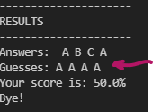
</p>
<br>

10. **git merge**
With our confidence in the score feature working, we would like to incorporate this feature back onto the main code. While we are still in the `score-feature` branch, we will use the `git add` and `git commit` commands first:<br>
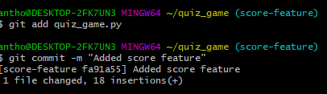
<br>

The reason we do these two commands first is because we are looking to make these code changes official for our main branch.
Now we are going to use the `git merge` command to take these official code changes in the `score-feature branch` and *merge* them with the main code in `main branch`.
To do this we must first be in the `main branch`. Type `git checkout main` to switch to the *main branch*:<br>
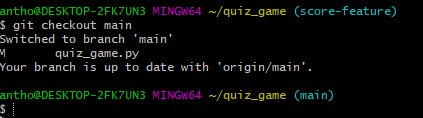
<br>

Now type `git merge score-feature`:<br>
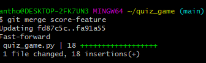
<br>

You will have done a successful merge if your command message looks like the above.
<br>

And just like before, we can finally do the `git push` command to update our github repo with the score feature code. But instead type in exactly this command `git push`:<br>
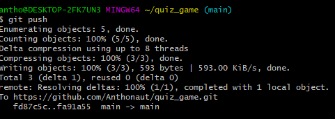
<br>

You'll notice that the `git push` command we wrote here *does not* contain the `origin main` after the git command. This is because since we are on the `main branch`, git will automatically push to the `main branch` for you. However, this is *not* good practice of writing the `git push` command.

Nevertheless, you should see the commit message next to the Python file on your github repo:<br>
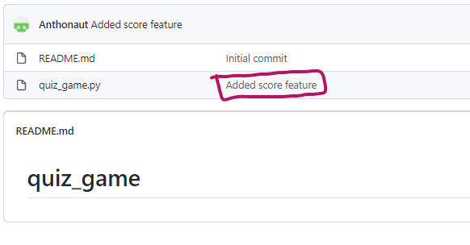
<br>

And you'll even see the code for the score feature if you click on the file:<br>
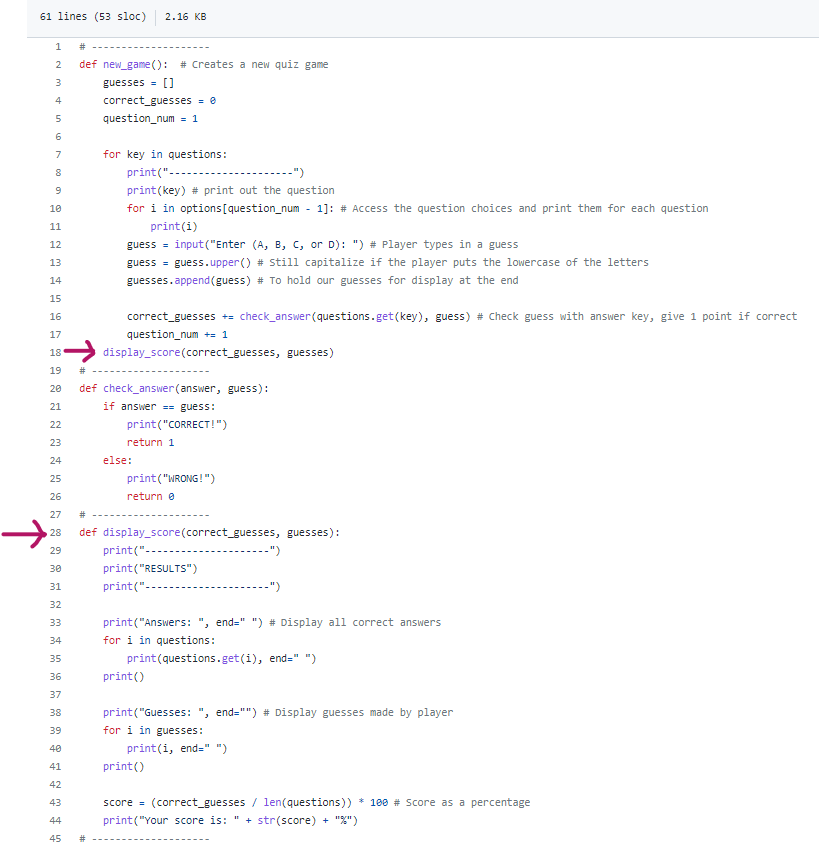
<br>

<Center>Congrats! You added a score feature to your quiz game with the `git branch` and `git merge` commands</Center>

**Merging**
You just did a merge in git with the score feature, but it's also important to what merges you can run into.
* *Fast forward* - The *git merge* you've performed above is called a *Fast-forward merge*. Simply put, because we *did not change* our main code since creating the `score-feature branch` to work on, we are "fast forwarding" these changes onto the main branch as if we did actually make these code changes to the `main branch` to start with.

* *Recursive-strategy* - This *git merge* occurs if we *did change* the main code since creating another branch (to make another feature) and merging it back into the `main branch`. An easy scenario of when this occurs is if you make two branches at the same time - i.e `feature-a branch` and `feature-b branch` - and try to merge both of them back onto the `main branch`. For our quiz game, you can imagine if we made another branch, such as `play-again-feature branch` at the same time as our `score-feature branch` and tried to merge both of these branches back to our `main branch`.

**Stashing**
We've learned how to make branches and merge them if we have features in mind for our project. But sometimes a feature we would like to implement may still be in a "draft phase" when coding it. However, we don't want this "draft code" we have to go away if we'd like to continue working on it after working on other parts of our project. This is where the `git stash` command is useful. *Stashing* in git is simply taking any code changes, no matter what branch you're on, and temporarily shelving it for later. 

This command is helpful because if you are working on different branches, you can consider *stashing* as a temporary save button. Without stashing, you would probably have to save the code changes on another file, which is tedious in the workflow of a project.

Let's consider using this for a *play again feature*, where we can ask the user if they would like to play the quiz game again.

11. **git stash**
Because we are looking to add a feature, we'll follow the same steps of creating a branch called `play-again-feature` and switching to it:<br>
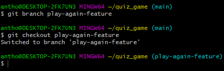
<br>


Open the **quiz_game.py** file and make the following code changes:
```python
# --------------------
def new_game():  # Creates a new quiz game
    guesses = []
    correct_guesses = 0
    question_num = 1

    for key in questions:
        print("---------------------")
        print(key) # print out the question
        for i in options[question_num - 1]: # Access the question choices and print them for each question
            print(i)
        guess = input("Enter (A, B, C, or D): ") # Player types in a guess
        guess = guess.upper() # Still capitalize if the player puts the lowercase of the letters
        guesses.append(guess) # To hold our guesses for display at the end

        correct_guesses += check_answer(questions.get(key), guess) # Check guess with answer key, give 1 point if correct
        question_num += 1
    display_score(correct_guesses, guesses)
# --------------------
def check_answer(answer, guess):
    if answer == guess:
        print("CORRECT!")
        return 1
    else:
        print("WRONG!")
        return 0
# --------------------
def display_score(correct_guesses, guesses):
    print("---------------------")
    print("RESULTS")
    print("---------------------")

    print("Answers: ", end=" ") # Display all correct answers
    for i in questions:
        print(questions.get(i), end=" ")
    print()

    print("Guesses: ", end="") # Display guesses made by player
    for i in guesses:
        print(i, end=" ")
    print()

    score = (correct_guesses / len(questions)) * 100 # Score as a percentage
    print("Your score is: " + str(score) + "%")
# --------------------
def play_again(): # If player wants to play again
    response = input("Do you want to play again? (yes or no): ")
    response = response.upper()

    if response == 'YES':
        return True # True, so we stay in the while loop
    else:
        return False # False, so we break out of the while loop
# --------------------

questions = { # A dictionary works to hold a question:answer pair (key:value)
    "Who created Python?": "A",
    "What year was Python created?": "B",
    "Python is attributed to which comedy group": "C",
    "Is the Earth round?": "A"
}

# A 2D list to hold the different answer choices for each question (e.g 1st list for question 1)
options = [["A. Guido van Rossum", "B. Elon Musk", "C. Bill Gates", "D. Mark Zuckerburg"],
          ["A. 1989", "B. 1991", "C. 2000", "D. 2016"],
          ["A. Lonely Island", "B. Smosh", "C. Monty Python", "D. SNL"],
          ["A. True","B. False", "C. sometimes", "D. What's Earth?"]]

new_game()

while play_again() == True: # If play_again() returns back True, start another quiz game
    new_game()

print("Bye!")
```
We've simpled created a `play_again()` function and implemented it as a while loop before the `print("Bye!")` statement.

Now we just implemented said play again feature, but maybe we aren't exactly sure if this is how we would like to implement it.

To know the feature worked, open **quiz_game.py** in your code editor and take note of the code for the play again feature we just added:<br>
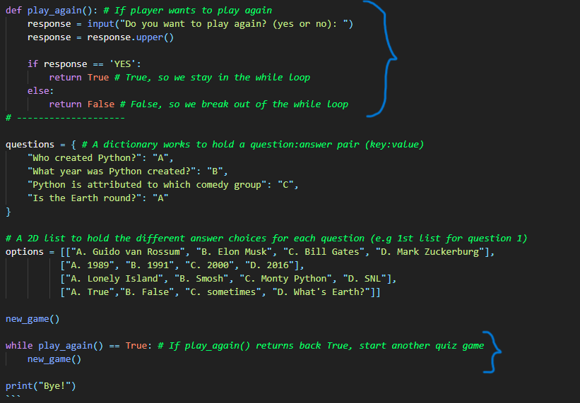
<br>

Now since we want to save this "rough draft" of the feature, we'll now use the `git stash` command. Type `git stash`:<br>
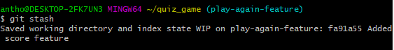
<br>

If you open **quiz_game.py** again, you'll notice that the same code we added is now gone:<br>
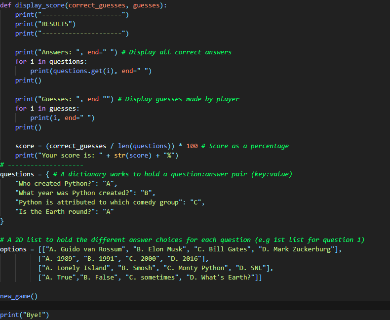
<br>
**Magic!**

We can even check with the command line `git stash` worked. Type `git stash list`:
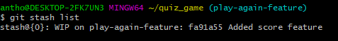
<br>

As you can see, `git stash list` shows all the code changes git has temporarily stored. It is identified by the line where `stash{0}...` is.
Each set of code changes you stash is indexed by the `stash{followed_by_a_number}...`. It's important to note that the *way* git stores your code changes in the stash is in a *stack*. By default, whatever code change you *last stashed* will be the *first code change* you can access back.

So we just decided that our rough draft of the play again feature was fine as is and would like to get the code for it back from the stash. To do so type `git stash apply`:<br>
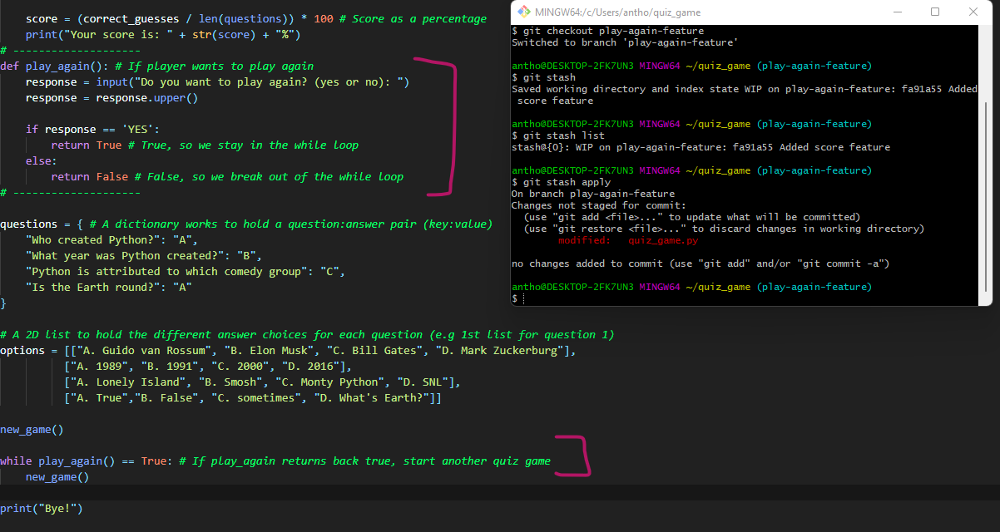
<br>

As you can see, our code for our play again feature is back from using the command above.
Since we are looking to update our github repo with the play again feature, we will merge the `play-again-feature branch` to the `main branch`.
Similarly to before, we will do the sequence of `git add`, `git commit`, `git merge` and `git push commands`:<br>
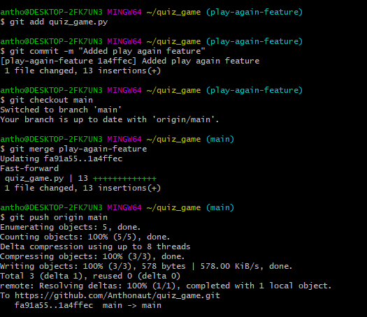
<br>

And if you check again on github, you'll see the commit message and code change for the play again feature:<br>
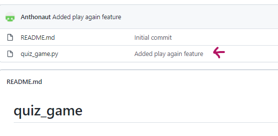
<br>

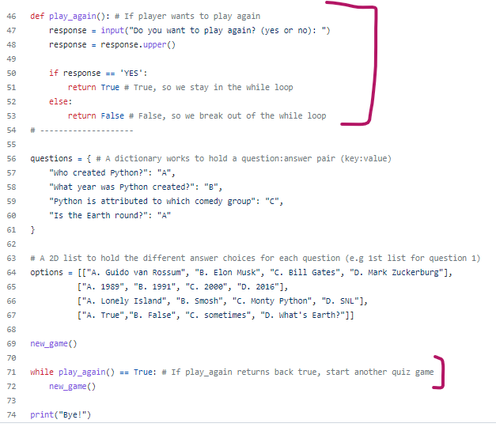
<br>

Good job! You used the `git stash` command on our play again feature for our quiz game.
<br>

<p align="center">
  
</p>

<Center>You have officially learned the basics of some git commands that you can now apply to your own project. There are of course more to git commands that must be learned, but knowing the basic commands puts you at a good start to continue learning them.</Center>